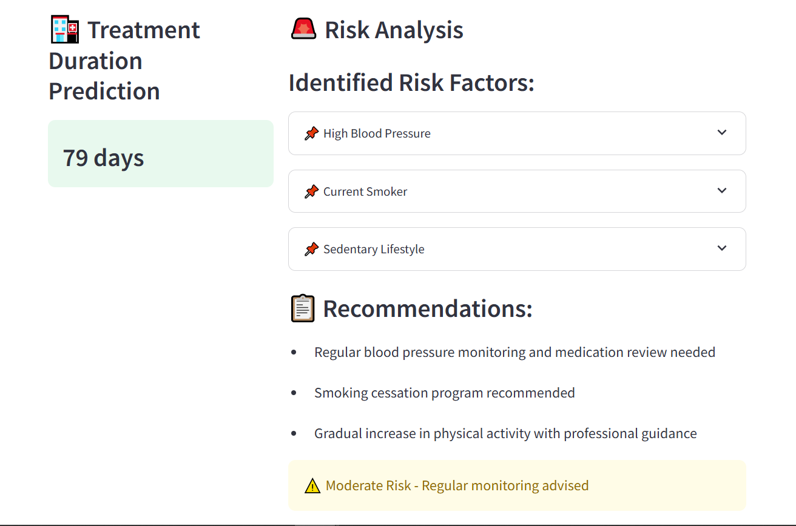

# Patient Treatment Duration Predictor

## 🏥 Project Overview
The Healthcare Treatment Duration Predictor is a machine learning-powered application designed to estimate the duration of medical treatment required for patients based on key health metrics, medical history, and lifestyle factors. Built using Streamlit, this interactive tool allows healthcare providers and patients to input various attributes, such as age, BMI, disease severity, heart rate, and more, to receive a customized prediction for treatment duration.The application also includes a comprehensive Risk Analysis module, which evaluates critical risk factors associated with each patient’s profile

## 🌟 Features
- **Treatment Duration Prediction**: Accurate estimation of treatment duration based on patient data
- **Risk Analysis**: Comprehensive evaluation of patient risk factors
- **Personalized Recommendations**: Tailored medical and lifestyle recommendations
- **Interactive Dashboard**: User-friendly interface for data input and visualization
- **Real-time Analysis**: Instant predictions and risk assessment

## 🔧 Technical Stack
- Python 
- Streamlit for web interface
- Scikit-learn for machine learning
- Pandas & NumPy for data processing
- Plotly for data visualization
- Linear Regression for advanced modeling

## 🚀 Live Demo
The application is deployed and available on Hugging Face Spaces:
[Access the live application here](https://huggingface.co/spaces/SanthoshKumar99/Patient_Treatment_Duration) 

## 📊 Model Details
- Algorithm: Linear regression with 93% accuracy
- Features: 15+ health metrics and patient characteristics
- Evaluation Metrics: R², MAE, MSE, RMSE


## 📝 Usage
1. Input patient information:
   - Basic demographics (age, BMI)
   - Medical measurements (heart rate, glucose level)
   - Medical history
   - Lifestyle factors

2. Click "Analyze Patient" to receive:
   - Predicted treatment duration
   - Risk factor analysis
   - Personalized recommendations

## 📁 Project Structure
```
Santhosh_Kumar_Treatment_Duration_Predictor/
├── app.py                     # Streamlit application
├── model.ipynb                # Model training script
├── requirements.txt           # Project dependencies
├── README.md                  # Project documentation
├── feature_names.pkl          # Feature names
├── treatment_duration_model.pkl  # Trained model             

```

## 📉 Output


## 👨‍🏫 Reference
* [Python Documentation](https://docs.python.org/3/)
* [pandas Documentation](https://pandas.pydata.org/docs/)
* [scikit-learn Documentation](https://scikit-learn.org/0.21/index.html)
* [numpy Documentation](https://numpy.org/doc/)
* [Streamlit Documentation](https://docs.streamlit.io/)

## 📄 License
This project is licensed under the MIT License - see the LICENSE file for details.

## 👥 Author
Santhosh Kumar
sksanthoshhkumar99@gmail.com

## 🙏 Acknowledgments
- Hugging Face for hosting the application
- The healthcare analytics community for insights and feedback
